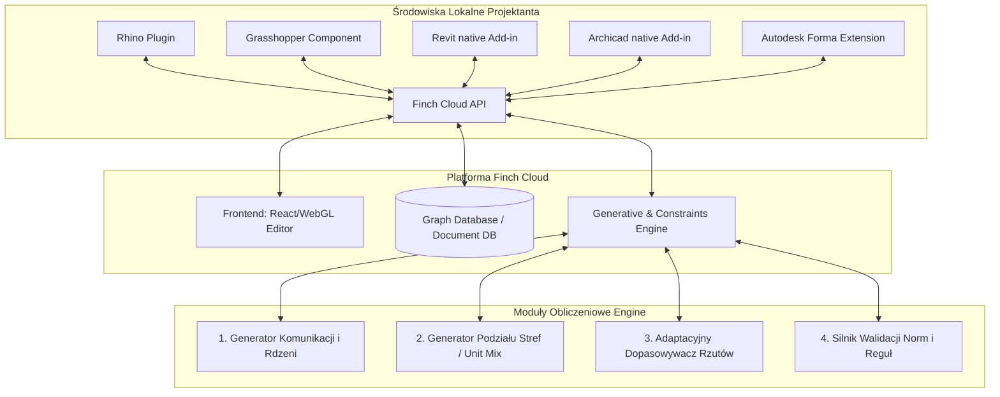

# Specyfikacja Systemowa i Architektoniczna Finch 3D Replica

Dokument ten stanowi szczegółowy opis mechanizmów, logiki, algorytmów i architektury aplikacji **Finch 3D**, sporządzony na podstawie analizy webinaru technologicznego (Finch Webinar). Celem opracowania jest dostarczenie inżynierskiego kompendium umożliwiającego zaprojektowanie i budowę podobnej aplikacji od zera.

---

## 1. WIZJA I PARADYGMAT SYSTEMU: „Od Rzemieślnika do Kuratora”
Finch 3D redefiniuje rolę architekta. Zamiast manualnego rysowania (CAD/BIM) pojedynczych wariantów, system generuje tysiące opcji spełniających zadane parametry brzegowe. Architekt przechodzi w tryb decyzyjny (kurator), ustawiając parametry (wejścia), a system optymalizuje i dopasowuje geometrię.

### Główne filary systemu:
1. **Interoperacyjność:** Praca bezpośrednio w chmurze (browser-based), połączona dwukierunkowo z Rhino, Grasshopper, Revit, Archicad i Autodesk Forma.
2. **Automatyzacja:** Szybkie generowanie rdzeni komunikacyjnych, miksu mieszkań i adaptacyjnych rzutów.
3. **Dostosowanie (Customization):** Uczenie algorytmów na bazie własnych, historycznych projektów i standardów projektowych firmy (biblioteki rzutów jako warstwa intencji).

---

## 2. ARCHITEKTURA SYSTEMU I PRZEPŁYW DANYCH (DATAFLOW)

Aplikacja opiera się na architekturze klient-serwer z centralnym silnikiem obliczeniowym w chmurze (Cloud Core), który stanowi jedyne źródło prawdy (Single Source of Truth).

### Przepływ Geometrii i Parametrów:
1. **Inicjalizacja:** Projektant tworzy bryłę budynku (Massing) w Rhino/Forma/Grasshopper.
2. **Eksport:** Wtyczka Finch eksportuje współrzędne wierzchołków bryły, podział na kondygnacje i linie siatki konstrukcyjnej (Grid lines) do chmury przez REST/WebSocket.
3. **Analiza i Generowanie w Chmurze:**
   - Webowa aplikacja renderuje bryłę 3D (WebGL / Three.js).
   - Silnik obliczeniowy dzieli kondygnacje na strefy użytkowe (Programy: Retail, Residential, Technical).
   - Algorytmy generują rdzenie pionowe, korytarze i ściany działowe mieszkań.
4. **BIM-Rebuild (Kluczowy proces):**
   - Zamiast przesyłać ciężkie pliki mesh (FBX/OBJ), wtyczka dla Revit/Archicad pobiera z chmury abstrakcyjną strukturę danych (np. linie środkowe ścian, punkty wstawienia drzwi z mapowaniem typów, identyfikatory grup).
   - Wtyczka lokalna uruchamia natywne API Revit/Archicad i **odbudowuje** ściany jako `Wall.Create()`, wstawia drzwi jako `FamilyInstance` i wczytuje meble z przypisanych bibliotek (Native BIM geometry).

### 2.1 Standard Jednostek Miar i Reprezentacji Geometrycznej
1. **Wewnętrzna jednostka miary (Integer Coordinate Basis):** Wszystkie wewnętrzne obliczenia geometryczne (silnik 2D, Clipper, wtyczki lokalne, serwer obliczeniowy, solver) muszą być realizowane na **liczbach całkowitych (integers)**, gdzie **1 jednostka = 1 centymetr (cm)**. Pozwala to całkowicie wyeliminować błędy zaokrągleń zmiennoprzecinkowych (`floating-point drift`), które są plagą tradycyjnych silników CAD. Ściana o fizycznej długości $5.34\text{ m}$ jest przechowywana w strukturach danych i bazie danych jako liczba $534$.
2. **Kalkulacja powierzchni:** Powierzchnia użytkowa lokali i kondygnacji jest obliczana wewnętrznie w centymetrach kwadratowych ($\text{cm}^2$).
3. **Prezentacja powierzchni:** Powierzchnia wyświetlana użytkownikowi w panelach wskaźników oraz eksportowana do raportów jest przeliczana na metry kwadratowe ($\text{m}^2$) poprzez podzielenie wartości $\text{cm}^2$ przez $10\ 000$. Wszystkie powierzchnie podawane są w **$\text{m}^2$ z przybliżeniem do dwóch miejsc po przecinku** przy zastosowaniu zaokrąglenia matematycznego (np. $54.32\text{ m}^2$).

---

## 3. SPECYFIKACJA FUNKCJONALNA MODUŁÓW

### Moduł 1: 3D Editor & Massing (Edytor Webowy)
* **Zadanie:** Wizualizacja 3D bryły budynku w przeglądarce, definiowanie przeznaczenia pięter (Programy) i kalkulacja wskaźników powierzchniowych w czasie rzeczywistym.
* **Wejście:** Geometria bryły z Rhino/Revit lub utworzona bezpośrednio w edytorze Finch.
* **Funkcjonalność:**
  - Przypisywanie funkcji (np. Retail na parterze, Residential na piętrach 1-10, Technical na dachu).
  - Dynamiczny panel wskaźników: GFA (Gross Floor Area), GIA (Gross Internal Area), NIA (Net Internal Area), zestawienia stolarki i kalkulacja parametrów finansowych (np. przychód/koszt węglowy).
  - Trójwymiarowa wizualizacja pionowych sekcji budynku (Vertical Stacking).

### Moduł 2: Generator Rdzeni (Cores) i Komunikacji
* **Zadanie:** Optymalne rozmieszczenie klatek schodowych, szybów windy oraz przebiegu korytarzy komunikacyjnych.
* **Wejście:** Kontur kondygnacji (poligon zewnętrzny) oraz ograniczenia normowe.
* **Parametry wejściowe:**
  - Maksymalna dopuszczalna odległość ewakuacyjna (Maximum egress distance).
  - Wymagana liczba klatek schodowych (lub wymuszenie stałej liczby, np. dokładnie 1 lub 3).
  - Szerokość korytarza.
* **Zachowanie:**
  - Algorytm analizuje poligon i generuje ścieżki korytarza.
  - Wyznacza strefy dla rdzeni (schody/windy) tak, aby odległość z każdego punktu planowanej powierzchni użytkowej do rdzenia nie przekraczała `egress_distance`.
  - W przypadku niespełnienia kryteriów (np. wymuszenie tylko 1 klatki schodowej przy bardzo długim budynku) system generuje wizualne ostrzeżenie (Validation Feedback), zaznaczając na czerwono strefy niebezpieczne (za daleko od wyjścia).

### Moduł 3: Generator Rozkładu Mieszkań (Unit Mix Generator)
* **Zadanie:** Podział strefy mieszkalnej (wokół korytarza) na poszczególne lokale według zadanego miksu powierzchniowego.
* **Wejście:** Poligon kondygnacji, wygenerowany korytarz, pozycje rdzeni pionowych, linie siatki konstrukcyjnej (Grid lines).
* **Parametry wejściowe:**
  - Docelowa proporcja miksu mieszkań (np. 30% mieszkań 50m², 40% 75m², 30% 120m²).
  - Tolerancja wymiarowa.
  - Siatka konstrukcyjna (Grid lines) — opcjonalne linie naprowadzające.
* **Zachowanie:**
  - Algorytm dzieli przestrzeń pomiędzy korytarzem a elewacją zewnętrzną na segmenty (apartamenty).
  - Działa na skomplikowanych i falujących elewacjach (Undulating facades), automatycznie wyliczając powierzchnię dla nieregularnych poligonów.
  - **Siatka konstrukcyjna (Grid snapping):** Algorytm szuka kompromisu (trade-off) pomiędzy idealnym dopasowaniem do żądanej powierzchni mieszkań a wyrównaniem ścian działowych do linii siatki konstrukcyjnej (słupów). Architekt suwakiem decyduje, który parametr ma wyższy priorytet.

### Moduł 4: Biblioteka Rzutów i Adaptacyjny Silnik Parametryczny (Constraint-Based Floor Plans)
* **Zadanie:** Dopasowywanie wewnętrznych układów mieszkań z biblioteki do nieregularnych poligonów mieszkań wygenerowanych na kondygnacji.
* **Wejście:** Poligon mieszkania (ze wskazaniem ściany korytarza - wejście, oraz ściany zewnętrznej - okna), biblioteka bazowych rzutów adaptacyjnych.
* **Funkcjonalność:**
  - **Rzuty Adaptacyjne (Adaptive Plans):** Wewnętrzny układ ścian nie jest sztywny. Ściany zachowują się jak sprężyny z ograniczeniami.
  - **System Ograniczeń (Constraints System):** Architekt może zablokować wybrane moduły (np. sztywny moduł łazienki 2x2m) lub zdefiniować reguły minimalnej/maksymalnej szerokości pomieszczeń (np. korytarz wejściowy min. 120 cm, dopuszczalna większa szerokość przy rozciąganiu).
  - **Dopasowanie do konturu:** Podczas rozciągania lub zmiany kształtu zewnętrznego poligonu mieszkania (np. skosy, łuki), elastyczne ściany dostosowują się to nowej geometrii, a zablokowane moduły (np. łazienka, kuchnia) przesuwają się w całości bez zmiany swoich wymiarów wewnętrznych.
  - **Kopiowanie topologii (Copy-Paste & Auto-Rotation):** Możliwość skopiowania układu z jednego mieszkania (`Ctrl+C`) i wklejenia do innych (`Ctrl+V`). System automatycznie wykrywa kierunek korytarza i obraca rzut tak, aby drzwi wejściowe znajdowały się przy komunikacji, a sypialnie przy oknach fasadowych.
  - **Powiązanie wariantów (Linking & Instancing):** Różne mieszkania oparte na tym samym szablonie rzutu pozostają połączone. Zmiana pozycji mebla (np. krzesła Eames, łóżka) w jednym z nich natychmiast aktualizuje pozycję tego obiektu we wszystkich powiązanych mieszkaniach, niezależnie od ich drobnych różnic geometrycznych wynikających z dopasowania do elewacji.

### Moduł 5: Asystent Reguł AI („Archie”)
* **Zadanie:** Automatyczna modyfikacja i audyt szczegółów rzutu pod kątem zadanych reguł technicznych i normowych w skali całego budynku.
* **Wejście:** Wygenerowane i zaakceptowane rzuty mieszkań.
* **Przykładowe zapytanie:** *"Upewnij się, że wszystkie drzwi przesuwne (pocket doors) są odsunięte o 2 cale od prostopadłej ściany"*.
* **Zachowanie:**
  - NLP (Natural Language Processing) tłumaczy zapytanie na regułę geometryczną.
  - Silnik reguł wyszukuje w całym projekcie wszystkie obiekty spełniające kryterium (drzwi przesuwne wewnątrz ścian).
  - Algorytm modyfikuje pozycje tych obiektów w setkach mieszkań jednocześnie (automatyczne mikrokorekty), oszczędzając architektowi godzin ręcznego przesuwania elementów w CAD.

### Moduł 6: Integracja BIM (Revit/Archicad Plugin)
* **Zadanie:** Rekonstrukcja geometrii 3D z chmury do natywnego środowiska BIM za pomocą API.
* **Funkcjonalność:**
  - Mapowanie rodzin (Family mapping): Ściany działowe z Finch są mapowane na określony typ ściany w Revit (np. "Finch Basic Wall" lub standardowa ściana gipsowo-kartonowa biura).
  - Rekonstrukcja na żywo: Wtyczka odczytuje dane rzutu i buduje natywne obiekty 3D.
  - Praca wewnątrz BIM (Direct Generation): Projektant może uruchomić okno Finch wewnątrz Revit/Archicad, kliknąć pustą strefę (Zone) mieszkania, wybrać drzwi wejściowe i wygenerować układ bezpośrednio do aktywnego modelu BIM bez opuszczania programu.

---

## 4. ALGORYTMY I WARUNKI GRANICZNE (BOUNDARY CONDITIONS)

Aby zbudować replikę Finch 3D, musisz zaimplementować cztery główne klasy algorytmów geometrycznych, stosując w nich rygorystyczne warunki graniczne (podane w wewnętrznych jednostkach systemowych - centymetrach):

### A. Algorytm Korytarzy i Rdzeni (Komunikacja)
1. **Odsunięcie Korytarza (Straight Skeleton / Medial Axis):**
   - Z poligonu zewnętrznego piętra generowany jest szkielet prosty (Straight Skeleton).
   - Korytarz centralny jest tworzony jako stałe odsunięcie (offset) od osi szkieletu.
   - **Warunek graniczny:** Minimalna szerokość korytarza ewakuacyjnego wynosi **$120\text{ cm}$** ($1.20\text{ m}$) w budownictwie mieszkaniowym oraz **$150\text{ cm}$** ($1.50\text{ m}$) w budynkach użyteczności publicznej.
2. **Rozmieszczanie i Parametry Rdzeni Ewakuacyjnych (Cores):**
   - Silnik obliczeniowy wyznacza strefy pionów komunikacyjnych na podstawie grafu widoczności kondygnacji.
   - **Maksymalna droga ewakuacji:** Odległość mierzona wzdłuż osi komunikacji od najdalszego punktu apartamentu do drzwi najbliższej klatki schodowej nie może przekroczyć **$2000\text{ cm}$** ($20.00\text{ m}$) dla jednej drogi ewakuacyjnej, lub **$4000\text{ cm}$** ($40.00\text{ m}$) przy zapewnieniu co najmniej dwóch niezależnych dróg.
   - **Odległość między klatkami:** W przypadku konieczności zastosowania $\ge 2$ klatek, minimalny dystans między nimi wynosi **$1000\text{ cm}$** ($10.00\text{ m}$).
   - **Wymiary szybów windy:** Minimalne wymiary wewnętrzne szybu dla standardowej windy osobowej (dostosowanej dla niepełnosprawnych) wynoszą **$160\text{ cm} \times 210\text{ cm}$**.
   - **Wymiary klatki schodowej:** Szerokość użytkowa biegu schodowego $\ge 120\text{ cm}$, spocznik $\ge 150\text{ cm} \times 120\text{ cm}$.
   - **Styk z elewacją:** Każda klatka schodowa musi przylegać do ściany elewacji zewnętrznej na długości minimum **$240\text{ cm}$** w celu zapewnienia naturalnego doświetlenia i strefy oddymiania (chyba że zastosowano mechaniczny system nadciśnieniowy).

### B. Algorytm Podziału na Mieszkania (Unit Mix Subdivision)
1. **Podział Poligonu Kondygnacji:**
   - Przestrzeń pomiędzy korytarzem a elewacją zewnętrzną dzielona jest prostopadłymi liniami działowymi.
   - Wykorzystuje się programowanie dynamiczne i algorytm pakowania (Knapsack Algorithm) do dopasowania powierzchni segmentów do pożądanego miksu lokali.
2. **Warunki Graniczne Apartamentu:**
   - **Szerokość frontu elewacyjnego:** Minimalna długość ściany zewnętrznej (elewacyjnej) dla jednego lokalu mieszkalnego to **$360\text{ cm}$**. Zapobiega to powstawaniu zbyt wąskich mieszkań.
   - **Stosunek boków (Aspect Ratio):** Maksymalny stosunek głębokości mieszkania (od wejścia do okna) do jego szerokości (wzdłuż elewacji) wynosi **$2.5:1$**.
   - **Dostęp z korytarza:** Każde mieszkanie musi posiadać krawędź styczną z korytarzem o długości minimum **$100\text{ cm}$** w celu prawidłowego osadzenia drzwi wejściowych o świetle przejścia min. $90\text{ cm}$ wraz z ościeżnicą.
   - **Tolerancja powierzchni:** Rzeczywista powierzchnia wygenerowanego lokalu może różnić się od docelowej powierzchni zadanej w parametrach miksu (np. $50.00\text{ m}^2$) maksymalnie o **$\pm 3\%$** (tj. tolerancja od $48.50\text{ m}^2$ do $51.50\text{ m}^2$).

### C. Algorytm Podziału na Pokoje (Inner Room Layout Constraints)
Solver geometryczny sterujący adaptacyjnymi rzutami mieszkań musi respektować następujące minimalne wymiary funkcjonalne wewnątrz apartamentów:
1. **Wymiary Pomieszczeń:**
   - **Sypialnia jednoosobowa:** Powierzchnia $\ge 9.00\text{ m}^2$ przy minimalnej szerokości pokoju **$220\text{ cm}$**.
   - **Sypialnia dwuosobowa (Master Bedroom):** Powierzchnia $\ge 12.00\text{ m}^2$ przy minimalnej szerokości pokoju **$270\text{ cm}$**.
   - **Pokój dzienny (Salon):** Powierzchnia $\ge 16.00\text{ m}^2$ przy minimalnej szerokości pokoju **$340\text{ cm}$**.
   - **Łazienka (z natryskiem i pralką):** Powierzchnia $\ge 4.00\text{ m}^2$ przy minimalnej szerokości pokoju **$180\text{ cm}$**.
2. **Wskaźnik Doświetlenia Naturalnego:**
   - Stosunek powierzchni okien w świetle ościeżnicy do powierzchni podłogi pomieszczenia mieszkalnego (pokój dzienny, sypialnia) must wynosić minimum **$1:8$** ($0.125$). Łazienki, garderoby i korytarze wewnętrzne mogą być pozbawione doświetlenia naturalnego.
3. **Grubość Ścian:**
   - Ściany międzylokalowe oraz ściany oddzielające lokale od komunikacji ogólnej: grubość **$25\text{ cm}$** (wymóg izolacyjności akustycznej).
   - Wewnętrzne ściany działowe w lokalu: grubość **$10\text{ cm}$** (dla konstrukcji szkieletowej lub murowanej z wykończeniem).

### D. Rozwiązywanie Układów Ograniczeń i Pattern Matching
1. **Model Grafu Ograniczeń:**
   - Ściany reprezentowane są jako krawędzie (odcinki), a ich połączenia jako wierzchołki.
   - Ograniczenia to równania:
     - Odległości punkt-punkt (wymiar pokoju).
     - Prostopadłości / równoległości ścian.
     - Stałości kształtu (zablokowany moduł łazienki).
2. **Implementacja Solvera:**
   - Rekomenduje się użycie algorytmu **Cassowary** (liniowy solver ograniczeń stosowany m.in. w silnikach autolayoutu Apple) lub silników opartych na sprężynach (Force-Directed Graph / Spring-Mass System).
   - Gdy użytkownik rozciąga zewnętrzny obwód apartamentu, solver Cassowary minimalizuje funkcję kosztu i wylicza nowe współrzędne ścian działowych, respektując twarde ograniczenia (np. stała szerokość łazienki) i miękkie ograniczenia (np. pokój powinien być jak największy).

### C. Analiza Kierunkowa i Topologia Rzutu (Pattern Matching)
Aby automatycznie obrócić rzut przy wklejaniu (`Ctrl+V`):
1. **Reprezentacja Topologiczna:**
   - Rzut apartamentu zapisywany jest jako graf skierowany, gdzie węzłami są pomieszczenia (kuchnia, salon, łazienka), a krawędziami drzwi/przejścia.
   - Graf posiada dwa specjalne porty zewnętrzne: `Port_Wejsciowy` (drzwi do korytarza) oraz `Port_Swietlny` (okna na elewacji).
2. **Dopasowanie do Nowego Poligonu:**
   - Algorytm analizuje poligon docelowy i identyfikuje krawędź stykającą się z korytarzem (miejsce na wejście) oraz krawędzie zewnętrzne (okna).
   - Następuje mapowanie grafu rzutu na geometrię docelową: obrót i odbicie lustrzane (Mirror) wykonywane są tak, aby zminimalizować odległość geometryczną portu wejściowego rzutu od korytarza fizycznego.

### D. Wyznaczanie Ścieżek Ewakuacyjnych (Routing & Egress)
1. **Analiza Dystansu:**
   - Tworzony jest graf widoczności (Visibility Graph) wewnątrz poligonu kondygnacji (omijający rdzenie i ściany).
   - Algorytm A* lub Dijkstra wylicza najkrótszą ścieżkę z najdalej oddalonego punktu każdego apartamentu do najbliższej klatki schodowej (rdzenia).
   - Jeśli najdłuższa ścieżka przekracza zdefiniowany `egress_distance`, system zgłasza błąd walidacji.

---

## 5. PROPONOWANY STOS TECHNOLOGICZNY (WEB-FIRST)

Aby zbudować taką aplikację w nowoczesnym stosie technologicznym, rekomenduję następujące rozwiązania:

### Frontend (Browser UI & 3D Web)
* **Framework:** React.js / Next.js (TypeScript) — zapewnia szybkie budowanie interfejsu i komponentów biblioteki.
* **Silnik 3D:** **Three.js** wraz z **React Three Fiber (R3F)** do renderowania akcelerowanego sprzętowo (WebGL) modeli 3D, kondygnacji i mebli w przeglądarce.
* **Obsługa Geometrii 2D/3D:** **Clipper.js** (do operacji na wielokątach: sumy, iloczyny, odsunięcia - offsety korytarzy) oraz **Earcut** (do triangulacji wielokątów).
* **State Management:** Zustand lub Redux do obsługi rozbudowanego stanu rzutów i parametrów.

### Backend (Algorytmy i API)
* **API Gateway / WebSocket:** Node.js (NestJS) lub Go (Golang) do obsługi komunikacji w czasie rzeczywistym (współpraca wielu użytkowników nad jednym modelem w chmurze).
* **Silnik Obliczeniowy (Geometry Service):** Python (z bibliotekami `Shapely`, `numpy`, `networkx`, `scipy`) lub C++ (z biblioteką **CGAL** - Computational Geometry Algorithms Library). Python jest doskonały do szybkiego prototypowania algorytmów podziału przestrzeni i optymalizacji miksu mieszkań.
* **Solver Ograniczeń (Constraint Solver):** Port algorytmu Cassowary dla JS/TS (np. `kiwi.js`) na frontendzie (dla płynnej interakcji podczas przeciągania ścian) oraz serwerowy solver w Pythonie/C++ do ostatecznego przeliczenia geometrii.

### Baza Danych
* **Główna baza:** PostgreSQL z rozszerzeniem **PostGIS** (najlepsza relacyjna baza danych do obsługi danych przestrzennych i zapytań geometrycznych 2D/3D).
* **Baza rzutów (opcjonalnie):** Neo4j (baza grafowa do reprezentacji topologii mieszkań i powiązań między meblami/ścianami).

### Integracje i Wtyczki (CAD/BIM Plugins)
* **Rhino / Grasshopper:** C# / .NET (RhinoCommon API) — komponenty Grasshoppera wysyłające dane geometryczne w formacie JSON do Cloud API.
* **Revit Add-in:** C# / .NET (Revit API) — wtyczka wczytująca JSON z chmury i rekonstruująca ściany, drzwi i rodziny przy użyciu transakcji Revit (`Autodesk.Revit.DB.Transaction`).
* **Archicad Add-in:** C++ (Archicad API DevKit) lub Python (poprzez wbudowane od wersji 24 narzędzia JSON-Connection API Archicada).

---

## 6. MAPA DROGOWA WDROŻENIA MVP (KROK PO KROKU)

Aby sprawnie zbudować działający prototyp (MVP), podziel prace na 4 etapy:

### Krok 1: Silnik geometryczny 2D i Edytor Webowy (Miesiąc 1-2)
1. Zaimplementuj prosty edytor 2D w przeglądarce (canvas lub Three.js w rzucie z góry).
2. Dodaj możliwość importu rysunku obrysu budynku (jako plik DXF lub poligon rysowany ręcznie).
3. Zaimplementuj algorytm odsunięcia (offsetu) generujący korytarz centralny wewnątrz poligonu (za pomocą biblioteki Clipper).

### Krok 2: Adaptacyjne Rzuty i Solver (Miesiąc 3-4)
1. Stwórz prosty edytor szablonów rzutów (np. pokój, łazienka).
2. Zintegruj solver `kiwi.js` (Cassowary), aby użytkownik mógł przesuwać ściany zewnętrzne szablonu, a ściany wewnętrzne dostosowywały się z zachowaniem reguł (np. "łazienka = stała").
3. Napisz algorytm mapowania: dopasuj szablon 2D rzutu do wygenerowanego poligonu mieszkania poprzez skalowanie i rozwiązywanie ograniczeń.

### Krok 3: Generator Komunikacji i Miksu Mieszkań (Miesiąc 5)
1. Zaimplementuj algorytm dzielący przestrzeń mieszkalną na strefy (podział prostopadły) i optymalizujący ich szerokości pod kątem zadanych powierzchni docelowych.
2. Dodaj algorytm wyliczający odległości ewakuacyjne (najkrótsza ścieżka A* do klatki schodowej) i oznaczaj kolorem czerwonym obszary niespełniające normy.

### Krok 4: Wtyczka do programu BIM (Miesiąc 6)
1. Napisz wtyczkę do Revit lub Archicad w C#.
2. Zaimplementuj parser JSON pobierający dane o wygenerowanych ścianach i otworach z chmury.
3. Uruchom pętlę generowania w BIM, tworzącą natywne ściany na podstawie współrzędnych 2D i wysokości pięter.
